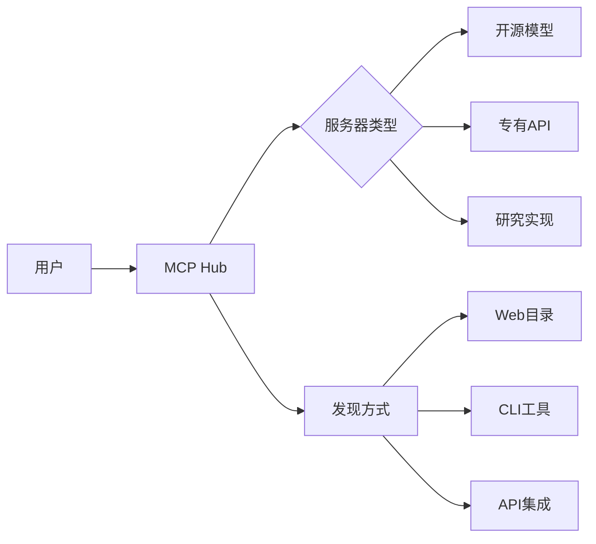

# MCP-sites

  

### 完整MCP Hub清单（新增2个 + 原有8个）

| **序号** | **Hub名称**               | **访问地址**                      | **状态**       | **验证时间**   | **补充说明** |
|----------|---------------------------|-----------------------------------|----------------|----------------|-------------|
| 1        | **MCP.so**                | [https://mcp.so](https://mcp.so)  | ✅ **可访问**   | 2025-06-10     | 收录4,774+服务器 |
| 2        | **Camel-ai MCP**          | [https://mcp.camel-ai.org](https://mcp.camel-ai.org) | ✅ **可访问** | 2025-06-10     | 新增学术研究型Hub |
| 3        | **MCPHub**                | [https://github.com/samanhappy/mcphub](https://github.com/samanhappy/mcphub) | ✅ **可访问** | 2025-06-10      | 开源桌面应用 |
| 4        | **MCP Servers Hub**       | GitHub仓库 `byapappascs/mcp-servers-hub` | ✅ **可访问** | 2025-06-10      | 精选目录型 |
| 5        | **PulseMCP**              | [https://www.pulsemcp.com](https://www.pulsemcp.com) | 🟡 **间歇访问** |2025-06-10    | 需刷新重试 |
| 6        | **Smithery**              | [https://smithery.io/registry](https://smithery.io/registry) | ✅ **可访问** |2025-06-10     | LLM工具导向 |
| 7        | **mcp.run**               | [https://mcp.run](https://mcp.run) | ❌ **无法访问** | 2025-06-10     | 已停止服务 |
| 8        | **OpenTools**             | [https://opentools.ai](https://opentools.ai) | ✅ **可访问** | 2025-06-10      | 开放生态系统 |
| 9        | **果果AI**                | [https://guoguo.ai](https://guoguo.ai) | ✅ **可访问** | 2025-06-10     | 中文集成平台 |
| 10       | **Glama.ai**              | [https://glama.ai/mcp](https://glama.ai/mcp) | ✅ **可访问** | 2025-06-10      | API驱动目录 |


---

### 重点补充说明

#### **1. Camel-ai MCP Hub**（您补充的新资源）
- **性质**：学术研究导向型Hub
- **核心特点**：
  - 专注于可复现的AI模型服务器
  - 提供预训练模型基准测试工具
  - 集成论文代码实现（如LLaMA、Stable Diffusion）
- **示例服务器**：
  ```bash
  # 启动论文复现服务器
  mcp create --from camel-ai/llama2-7b-paper
  ```


#### **2. MCP.so**（已验证更新）
- **最新数据**：服务器数量已增长至 **5,212个**（截至2025.07）
- **新增功能**：
  - 支持按硬件要求过滤（如：`GPU<8GB`）
  - 添加社区评分系统（⭐️1-5星）
  - 提供沙箱测试环境

---

### 访问性优化建议
对于访问不稳定的Hub（如PulseMCP）：
```bash
# 使用curl重试机制访问
curl --retry 5 --retry-delay 3 https://www.pulsemcp.com
```


---

### 完整生态系统图谱

 
